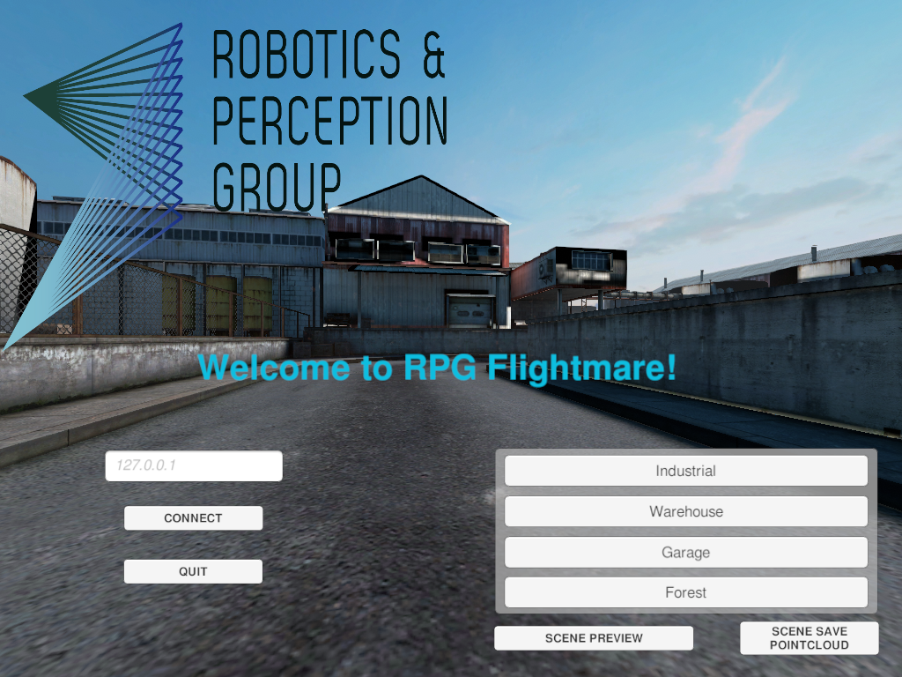

# RPG Flightmare Unity

RPG Flightmare Unity is a [Unity](https://unity.com/) project for building the photorealistic image rendering engine
of the [RPG Flightmare simulator](https://github.com/uzh-rpg/flightmare).   

# Getting started

---

Read the documentation (TODO: Add readTheDocs link)

# Acknowledgements

This project is inspired by [FlightGoggles](https://github.com/mit-fast/FlightGoggles), we use some components from FlightGoggles. 

The demo scene **Industrial**, which we added in the repository, was created by Dmitrii Kutsenko and is freely available in the asset store. The original asset can be found [here](https://assetstore.unity.com/packages/3d/environments/industrial/rpg-fps-game-assets-for-pc-mobile-industrial-set-v2-0-86679). 
